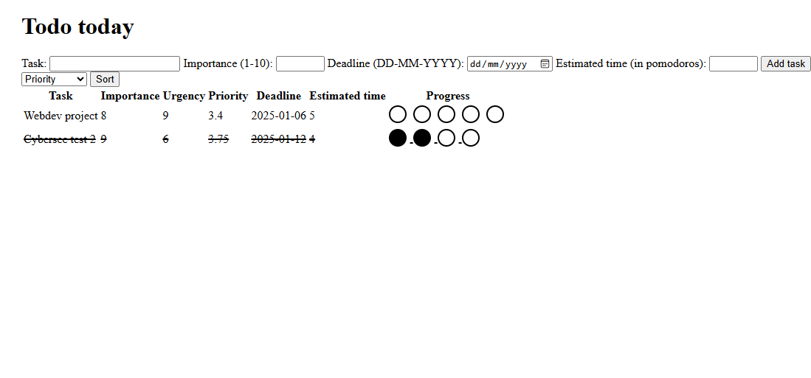

# Todo list
A simple to-do list built with Flask and JavaScript designed to help you decide which tasks require your immediate attention.

## Features
- **Add tasks**: Add new tasks to the list.
- **Sort tasks**: Sort your tasks by priority, urgency, or importance.
- **Mark progress**: Keep track of your progress on tasks.

## Installation:
To get started with this project, follow these steps:
```bash
git clone https://github.com/mcjmk/todolist.git
cd todolist
python app.py
``` 
Go to http://127.0.0.1:5000/ where the server will be running

